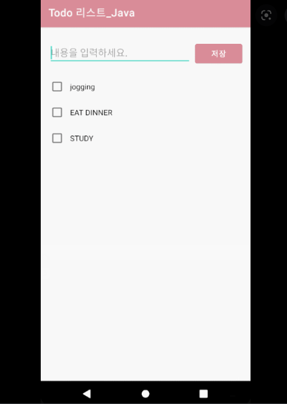

# 🏁 Started From Bottom - To Do List

## ✅ Rules
#22.11.04 모든 소스는 카멜 기법 기반으로 작성 부탁드립니다. 파일명과 변수는 소문자로 시작 클래스, 파일명은 대문자로 시작 부탁드립니다.
> 카멜 기법은 소스코드를 작성할 때 변수 또는 함수 등의 이름을 정하는 방법 중 하나입니다. 예를 들면 다음과 같습니다.
```
# 변수
FooBar = 3 (X, 파스칼 기법)
foo_bar = 3 (X, 스네이크 기법)
fooBar = 3 (O, 카멜 기법)

# 함수
def FooBar(): (X, 파스칼 기법)
def foo_bar(): (X, 스네이크 기법)
def fooBar(): (O, 카멜 기법)
```

## 👀 Samples


## 🧑‍💻 Functions

1. 싱글페이지 어플리케이션으로 `프로토타입`을 만든다
	1. 최상단에 내용입력하는 텍스트필드
		1. [x] placeholder
		2. [x] 입력 받아서 적용될 상태 프로퍼티
	2. 텍스트필드 우측에 저장 버튼
		1. [x] 버튼을 눌렀을 때 배열에 저장
		2. [x] 저장한 후에 텍스트 상태 프로퍼티 초기화
		3. [x] 공백이 들어갈 때를 방지할 수 있는 방어코드를 적자
			- 함수에 넣는 게 직관적일 거 같다
				- 텍스트가 있으면 리스트에 데이터가 추가되고
				- 없으면 추가가 되지 않게
		4. [x] 공백일 때 Alert 기능 구현해보자
			1. 상태 프로퍼티를 선언하여 alert의 상태를 통제할 수 있도록 한다
			2. Button에 .alert을 추가한다!
	3. 하단에 리스트로 텍스트필드 테이터를 뿌려준다.
		1. [x] 상태 프로퍼티에 받아온 데이터를 배열로 저장
		2. [x] 배열을 선언
		3. [x] 반복문을 사용하여 List 생성
			1. [x] ForEach 반복문
		4. 터치해서 체크 여부
	4. 각 리스트데이터를 수정/삭제할 수 있도록 버튼을 만들어준다.
		- 수정/ 삭제 버튼을 컨텍스트 메뉴로!
			- 왜? 버튼으로 구현하는 경우 리스트를 누르는 경우와 중복될 수 있음
			- [x] 배운 기능인 삭제버튼을 먼저 구현해 보자!

## 👀 추가해보고 싶은 기능
- 정선: Enter를 눌렀을 때도 save와 동일한 기능을 하게끔
- 리스트를 터치하는 경우 check/uncheck가 되도록 sf symbols를 이용하여 바꿔보고 싶음

## ☄️Trouble Shooting
1. Cannot use mutating member on immutable value: 'self' is immutable
	- 에러 메세지 내용: 배열에 가변형 inputText를 저장하려다가 발견한 에러 메세지
		- mutating
			- 특정 메소드 내에서 구조체 또는 열거형의 프로퍼티를 수정해야 하는 경우, 해당 메소드의 동작을 변경하도록 하는 것
		- immutable
			- ?!  
			```
				Button {
					// 버튼을 눌렀을때 입력받은 inputText를 배열에 저장한다
					todoListData.append(inputText)
				} label: {
					Text("저장")
				}
			```
	- 해결 방법!
	- todoListData 배열을 @State var로 상태 프로퍼티로 선언해주니까 해결되었다!
2. 

## 👥 Members
|김보미|박정선|박훈종|
|------|---|---|
|[bomyuniverse](https://github.com/bomyuniverse)|[JSPark0099](https://github.com/JSPark0099)|[hoonjong96](https://github.com/hoonjong96)|
